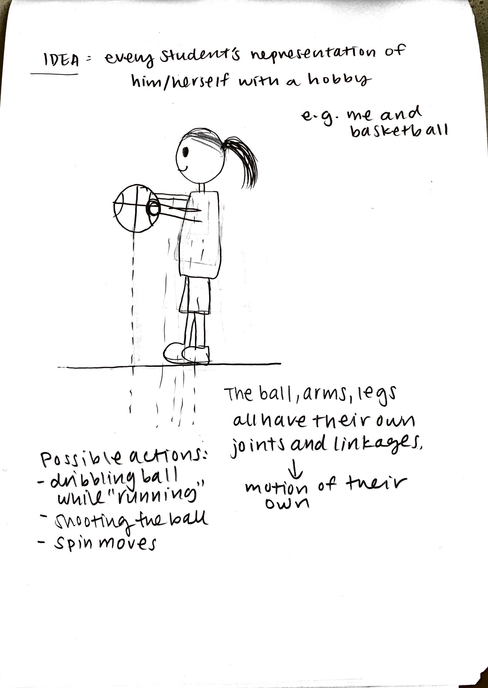
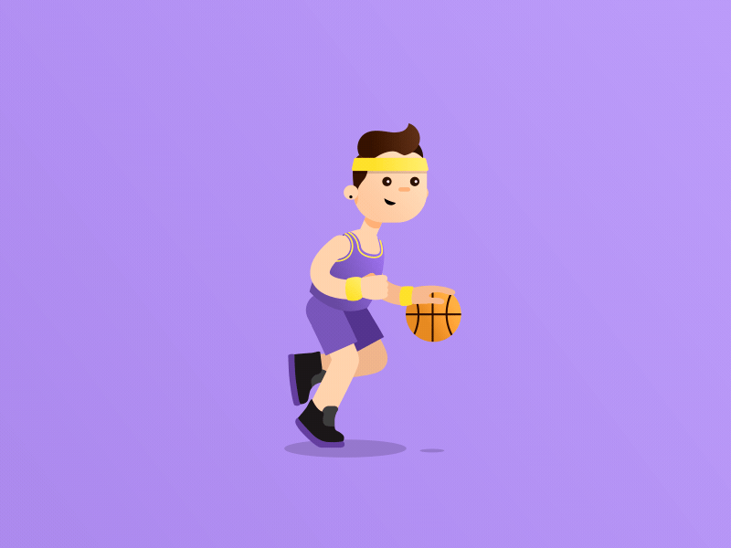
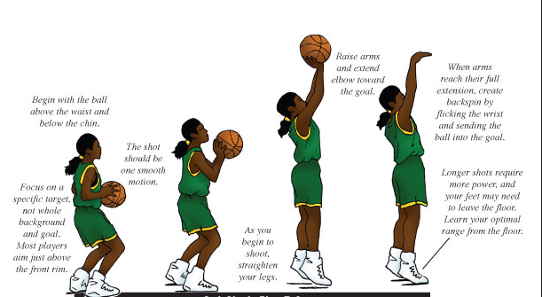
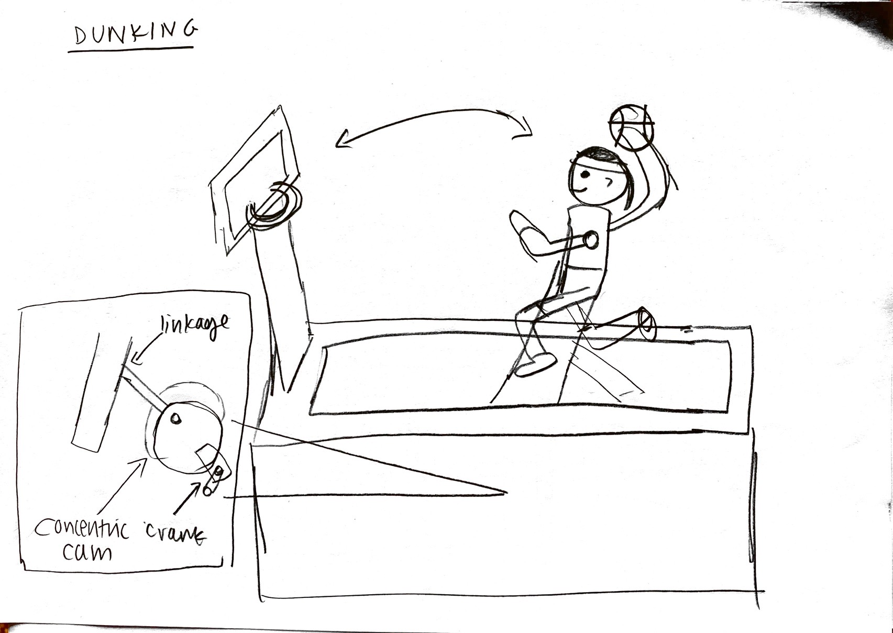
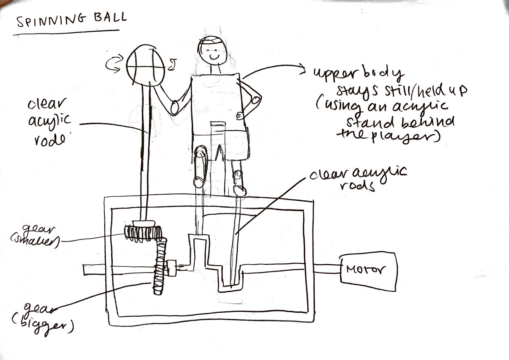

## Final project, here we go! -- 1 April

First some ideas for themes:
- country specific 
    - foods
    - cultural practices
    - clothes
- toys/animals
- each individual student as a figure and his/her hobby

## Super rough draft of an idea that I had: 
 

## Chosen topic: something that represents us! -- 6 April 
After a vote, we decided as with a majority of the class picking the option I proposed of the theme being a representation of ourself. YAY! This news was great because it also happened to be topic that I had done a brief brainstorming and sketch of (as seen above). Now it was about expanding this design and idea and incorporate new elements into it.  

I began the next step by thinking of different levels of activity that activates at different points in the hour e.g. a low level which might be activated on the quarter hour, a medium level on the half hour, and a high level which will be activated on the hour. I had briefly thought about the possible different actions that I could have, already in my initial design, and so I simply went from these ideas and attempted to find some examples of these actions in play so that I could see what sorts of movements, joints, and connections I needed to design and implement. Below are some examples:

Low level -- normal mediocre dibbling:

Medium level -- some cool dribbling techniques:

High level -- shooting the basketball: 

 

The next step was to obviousy think of the degree and range of motions that I would need my person to perform to encompass all three types of activity as shown above. I did not know what materials to use and how to go about this, except for the fact that the ball would be placed on some acrylic rod or something transparent so that the ball looks like it is floating as it should do in normal basketball (i.e. without a support). Michael suggested that I create 3 different components -- one encompassing each level of activity. To highlight which component is moving, I could use something like a spotlight that brings attention to one component rather than all three at once. 
 

Interesting reference video:

## Refining idea, adding details -- 8 April
**Dimensions**: The character would be around 20 cm tall, ball would be proportional to the body as they are in real life. Need 3 sets of these. IMPORTANT DECISION I NEED TO MAKE -- make the person 3D or simply 2D (flat??) 

**What materials you will use for each piece?**: I think plastic would be the easiest as it is the lightest, maybe 3D printed?. Especially when it comes to moving a lot of components at once, it would be less of an issue for the motors to move them around.    

**How will you design it in Fusion 360?**: Great question, don't know the answer. I guess I have to first try out the linkages and cams and different joints to make sure parts move like how I want them to, then I will move to creating the other body parts that are considered less essential.  

**What machine will be used to fabricate each piece?**: 3D printing (especially needed if I were to have a 3D figure), laser cutting (for the balls?) 

**How each piece will attach to the rest? Glue? Bolts?**: mostly bolts for the figures, glue for the ball onto the clear rod 

## Refining idea, adding details (part 2) -- 13 April
I decided on 3 levels of activity that I wanted my part of the clock to have: 1) dribbling, 2) spinning a basketball on one finger, and 3) dunking. 
 
 
