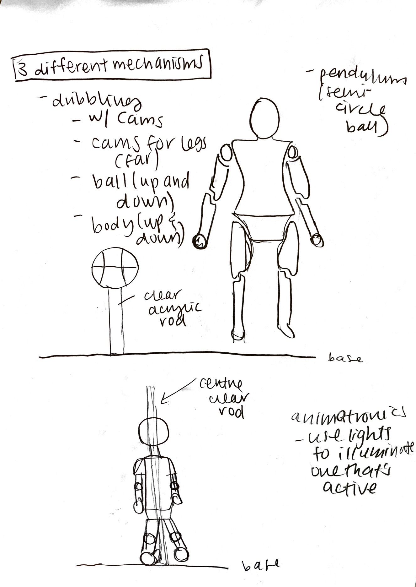

## Final project, here we go! -- 1 April

First some ideas for themes:
- country specific 
    - foods
    - cultural practices
    - clothes
- toys/animals
- each individual student as a figure and his/her hobby

## Super rough draft of an idea that I had: 
 

## Chosen topic: something that represents us! -- 6 April 
After a vote, we decided as with a majority of the class picking the option I proposed of the theme being a representation of ourself. YAY! This news was great because it also happened to be topic that I had done a brief brainstorming and sketch of (as seen above). Now it was about expanding this design and idea and incorporate new elements into it.  

I began the next step by thinking of different levels of activity that activates at different points in the hour e.g. a low level which might be activated on the quarter hour, a medium level on the half hour, and a high level which will be activated on the hour. I had briefly thought about the possible different actions that I could have, already in my initial design, and so I simply went from these ideas and attempted to find some examples of these actions in play so that I could see what sorts of movements, joints, and connections I needed to design and implement. Below are some examples:

Low level -- normal mediocre dibbling:

Medium level -- some cool dribbling techniques:

High level -- shooting the basketball: 

 

The next step was to obviousy think of the degree and range of motions that I would need my person to perform to encompass all three types of activity as shown above. I did not know what materials to use and how to go about this, except for the fact that the ball would be placed on some acrylic rod or something transparent so that the ball looks like it is floating as it should do in normal basketball (i.e. without a support). Michael suggested that I create 3 different components -- one encompassing each level of activity. To highlight which component is moving, I could use something like a spotlight that brings attention to one component rather than all three at once. 
 

Interesting reference video:

## Refining idea, adding details -- 8 April
**Dimensions**: The character would be around 20 cm tall, ball would be proportional to the body as they are in real life. Need 3 sets of these. IMPORTANT DECISION I NEED TO MAKE -- make the person 3D or simply 2D (flat??) 

**What materials you will use for each piece?**: I think plastic would be the easiest as it is the lightest, maybe 3D printed?. Especially when it comes to moving a lot of components at once, it would be less of an issue for the motors to move them around.    

**How will you design it in Fusion 360?**: Great question, don't know the answer. I guess I have to first try out the linkages and cams and different joints to make sure parts move like how I want them to, then I will move to creating the other body parts that are considered less essential.  

**What machine will be used to fabricate each piece?**: 3D printing (especially needed if I were to have a 3D figure), laser cutting (for the balls?) 

**How each piece will attach to the rest? Glue? Bolts?**: mostly bolts for the figures, glue for the ball onto the clear rod 

## Refining idea, adding details (part 2) -- 13 April
I decided on 3 levels of activity that I wanted my part of the clock to have: 1) dribbling, 2) spinning a basketball on one finger, and 3) dunking. 
 
 
 

## Designs on Fusion 360! -- 22 April
In the midst of all the designing and trying to figure out Fusion, I forgot to update my documentation. But, here goes. 
After some discussion in class, I decided to stick to working on the mechanisms of spinning a basketball and dunking first, and seeing where that takes me before attempting to work out the logistics of doing the dribbling mechanism. Before starting the designs on Fusion, I made sure to have some 

**Mechanism 1: Dunking**
Here is my design visualised on Fusion 360. 
 
    

Thoughts: Took me a while to work out the different joints to use, despite having done the exercise to work on our understanding of joints. I also found out to mimic the actual linkage and turning system in real life, you have to ground certain objects. I found this out after lots of trial and error (and frustration). 

**Mechanism 2: Spinning Ball with Finger**
Design visualised on Fusion 360. 
  

This design, as compared to the first mechanism, was harder to realise in that I had to learn new Fusion 360 skills that we didn't go through before. Originally, I had built this system with regular gears and not bevel gears, because I couldn't find McMaster-Carr components of bevel gears that fit within the dimensions and that I wanted. During our class check-up, Michael made me aware that there was a plug-in that I could employ to build custom bevel gears. After Googling and finding this extension, however, I realised that it only works on Windows operating systems and not Macs and so being able to use this extension was out of the picture. I then proceeded to experiment with importing McMaster-Carr components and trying to alter them in some way. I didn't really think this was possible (Michael as well) as when you import them into your design, they don't come with Sketches attached to them. After a lot of clicking and pressing delete, I found out how to delete elements and add elements to imported McMaster-Carr components!! If anyone needs help, let me know!    

Here are the bevel gears, closer-up:
 

In my design, you'll notice that while the two bevel gears have different number of teeth (30 and 20, respectively), when I run/turn the mechanism, they align and match up perfectly. I was able to do so using the 'Motion Link' feature where I did some maths (30/20 * 360 degrees = 540 degrees; ie when the bigger bevel gear spins 360 degrees, the smaller one would have turned 540 degrees). 

I would also like to note that modelling the movements of this particular mechanism as it would in real life took A LONG time for me to get to. I had to make dummy components that consist solely of joint origins, had to ground certain elements, connect one joint to another, etc. Doing all of this was so rewarding in my opinion because I feel like I'm really learning how to use CAD.

 

## Designs on Fusion 360! (more!) -- 29 April
It seems that everything in the ERB has been halted, meaning the parts that I sent to get laser cut and 3D printed are still in progress and I'm unsure when I will be able to start putting the parts together. In the meantime, I have made my character and placed them onto my mechanisms.   
**Mechanism 1** 
  
**Mechanism 2** 
 
Note that for mechanism 2, it seems like the character is so far away from the ball. When I put the mechanism together in real life, they will not be like the image. I just couldn't move the gear part of the mechanism over without breaking the joints and the movements. 

## Designs on Fusion 360! (more! x2 and FINAL!) -- 11 May
I didn't update my journal last week to reflect this change but I actually found a nicer looking basketball hoop for Mechanism 1 that I'm going to use instead of the very simple one that I made myself. This is shown in the image below that I'm going to use to show where motors are going to be placed.

The last part of my project that I really needed to focus on was thinking about how the motor is going to be attached and how the board is going to be secured onto the platform in which the mechanism is going to be placed. I ran into quite a lot of trouble with this for Mechanism 1. I realised that the initial linkages and mechanisms that I had built are actually very poorly made. Some parts in there were unnecessary, some parts too big, some parts misplaced. The mechanism itself, when the crank was turning, moved the character so far back that she "went through" the top wall. I had to figure out how to change the size of parts, move joints, etc. so that the parts still stayed intact and most importantly, that the whole mechanism still works well and functions. This process took a lot of trial and error and retracing my steps. I had to figure out which parts to alter first before moving on to altering other parts, constantly asking myself questions like whether I should change the size of component X first or should I attempt to move the joint that is attached to said component first. 

Although this process was frustrating to say the least, it made me realise how important dimensioning and the initial design process is. I had dimensioned out my sketch but made some careless design decisions that made coming back to change the design at a later stage harder (I didn't note down any changes to my design that I had made in terms of dimensions, placement, etc after I started to make them in Fusion). Hamdulillah that everything worked out in the end and I was able to make the changes that I felt necessary, but it could have saved me a lot of time if I had just been more careful and attentive to what I was doing the first time around. 

The following two pictures show the "ends" of the movement that Mechanism 1 has after I successfully made the changes to component size and attached the motor in the right position.  
    
      
 
The following are the final products!
**Mechanism 1**  
  
**Mechanism 2** 
 
