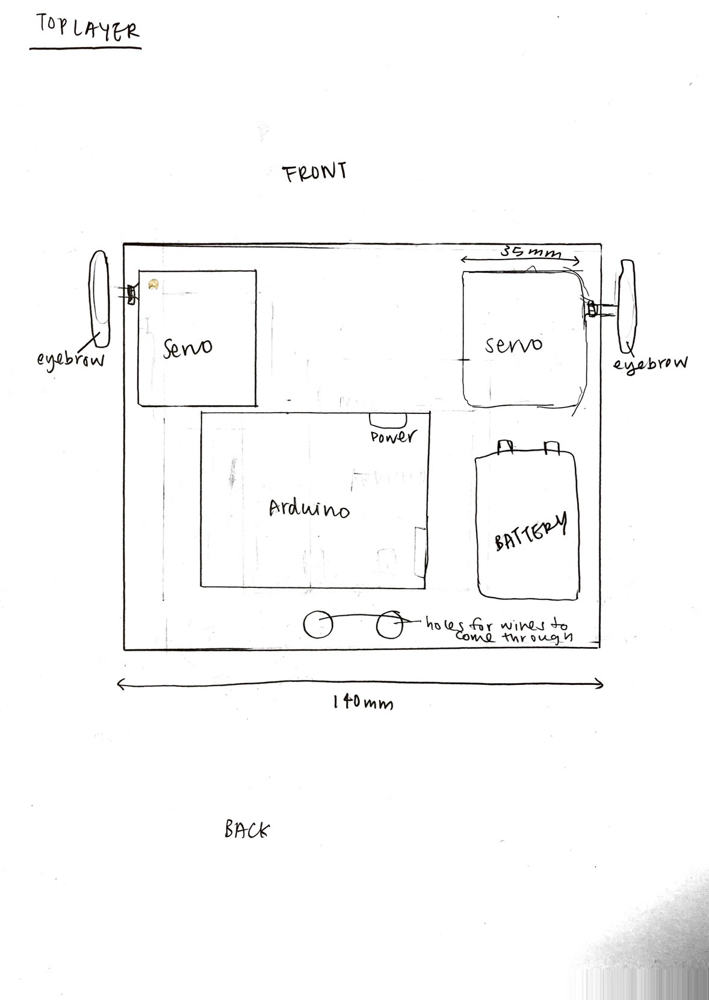

## Sketch 1 (very very preliminary):
 
This is my design of a frog, which I felt inspired to create after doing the readings and seeing many initial designs of animals whose actions could be replicated through simple machines. 

## Sketch 2 (adding dimensions -- we're getting somewhere):
The title and the descriptions on the papers are self-explanatory. I added dimensions to my design after getting the actual parts and trying to piece them together preliminarily. Before moving on to design the bottom layer and the top layer, I met up with Michael 
  
Before moving on to design the bottom layer and the top layer, I met up with Michael to ask some questions that I had on my initial planning document. I got my questions answered and proceeded to draw out the layout of the two layers that I would need for my frog project -- the top for the servo to power the eyebrows of the frog, and the bottom with the actual stepper motors to actually move the frog.
 
 

## Prototyping (let's use some cardboard to have fun!):
  
This is the cardboard that I had drawn out the outline of the side profile of the frog to be cut out. The frog itself became more like the size of a pet bunny rather than a frog but oh well.
 
These are the two pieces that of the two layers, bottom and top, in which the parts would lay flat on.
 
The parts of the super long rod that Michael cut for me (!!) placed on top of my to-scale sketch.
 
I asked Michael to explain to me how the linkages worked for the legs in this case, and he made this example super quickly to demonstrate to me what I should think about and how I should make my linkages (e.g. be careful of the lengths, etc.). 

And before I could proceed, everything changed.... But that's okay, here are some random reflections: 
- The frog is so much bigger than I thought it would be, and I realised this only after starting drawing down actual dimensions and starting to make a prototype. In conclusion, I should ALWAYS make a to-scale sketch and prototype before making some for reals. 
- Building things by hand is so fun
- Linkages work so different depending on the length of the different pieces that are attached to each other. Make sure to experiment around with them!!
